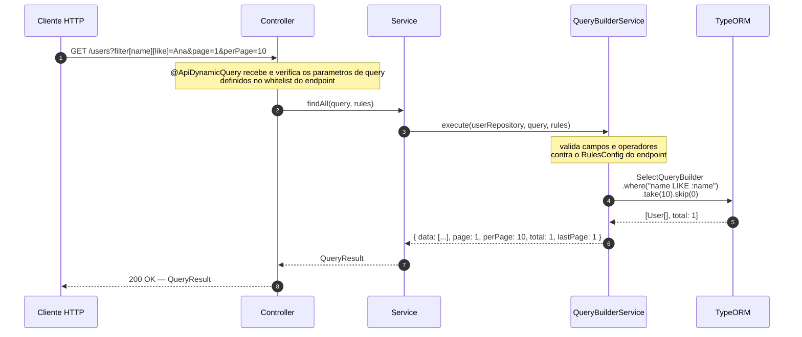

Se você quer validar a biblioteca rapidamente, este é o caminho mais curto:

1. instalar o pacote
2. configurar os pré-requisitos do NestJS
3. decorar um endpoint com `@ApiDynamicQuery`
4. injetar `@QueryRules()`
5. chamar `queryBuilderService.execute()`

## Exemplo mínimo

```typescript title="users.controller.ts"
import { Controller, Get, Query } from '@nestjs/common';
import { ApiTags } from '@nestjs/swagger';
import {
  ApiDynamicQuery,
  DynamicQueryDto,
  QueryRules,
  RulesConfig,
} from 'nestjs-rest-query';
import { UsersService } from './users.service';

@ApiTags('users')
@Controller('users')
export class UsersController {
  constructor(private readonly usersService: UsersService) {}

  @Get()
  @ApiDynamicQuery({
    filters: ['name', 'email', 'status'],
    sorts: ['name', 'createdAt'],
    fields: ['id', 'name', 'email', 'status', 'createdAt'],
  })
  findAll(@Query() query: DynamicQueryDto, @QueryRules() rules: RulesConfig) {
    return this.usersService.findAll(query, rules);
  }
}
```

```typescript title="users.service.ts"
import { Injectable } from '@nestjs/common';
import { InjectRepository } from '@nestjs/typeorm';
import { Repository } from 'typeorm';
import {
  DynamicQueryDto,
  QueryBuilderService,
  QueryResult,
  RulesConfig,
} from 'nestjs-rest-query';
import { User } from './user.entity';

@Injectable()
export class UsersService {
  constructor(
    @InjectRepository(User)
    private readonly usersRepo: Repository<User>,
    private readonly queryBuilderService: QueryBuilderService
  ) {}

  findAll(
    query: DynamicQueryDto,
    rules: RulesConfig
  ): Promise<QueryResult<User>> {
    return this.queryBuilderService.execute(this.usersRepo, query, rules);
  }
}
```

## Exemplo de uso

```http
GET /users?filter[name][like]=ana&page=1&perPage=10
```

Resposta esperada:

```json
{
  "data": [
    {
      "id": 1,
      "name": "Ana Lima",
      "email": "ana@email.com",
      "status": "active"
    }
  ],
  "page": 1,
  "perPage": 10,
  "total": 1,
  "lastPage": 1
}
```

## Ciclo de vida da requisição



Se funcionou, siga para o [Guia de Uso](/docs/usage) para ver todos os parâmetros, operadores e opções de whitelist.
