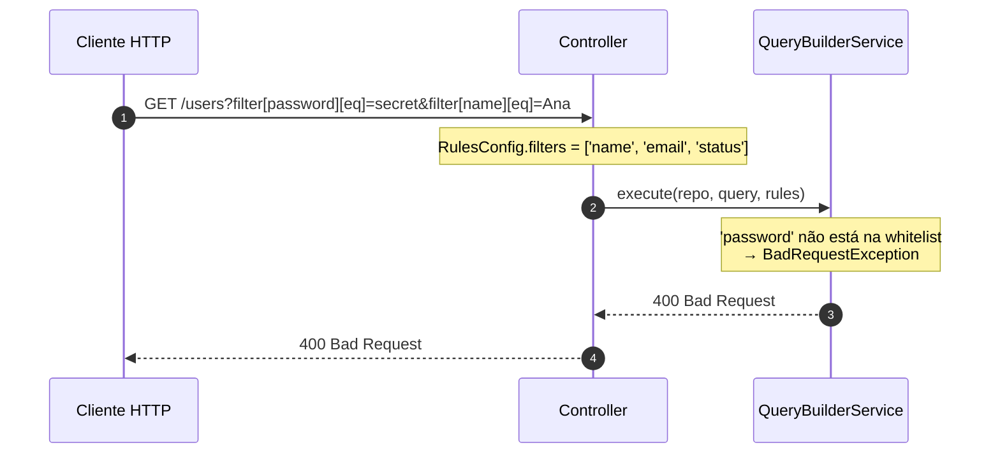

Se você ainda não tem um endpoint funcionando, comece por [Primeiro endpoint](/docs/getting-started/first-endpoint). Esta página é a referência dos decorators, parâmetros, operadores e whitelist de segurança.

## Decorators

### `@ApiDynamicQuery(rules)`

Decorator de método para endpoints que precisam de documentação Swagger. Faz duas coisas simultaneamente:

- Armazena o `RulesConfig` como metadata no método (lido por `@QueryRules()` em runtime)
- Gera `@ApiQuery` automaticamente para todos os parâmetros suportados (filtros, sort, fields, includes, page, perPage)

```typescript
@Get()
@ApiDynamicQuery({
  filters: ['name', 'email', 'createdAt'],
  sorts: ['name', 'createdAt'],
  fields: ['id', 'name', 'email', 'createdAt'],
  includes: ['company'],
})
async findAll(/* ... */) {}
```

### `@DynamicQuery(rules)`

Idêntico ao `@ApiDynamicQuery`, mas **sem geração de Swagger**. Use em endpoints internos ou quando não tiver `@nestjs/swagger` instalado.

```typescript
@Get()
@DynamicQuery({
  filters: ['name', 'status'],
  sorts: ['name'],
})
async findAll(/* ... */) {}
```

### `@QueryRules()`

Decorator de **parâmetro** que lê o `RulesConfig` armazenado pelo `@ApiDynamicQuery` ou `@DynamicQuery` e o injeta como argumento do método em runtime.

```typescript
async findAll(
  @Query() query: DynamicQueryDto,
  @QueryRules() rules: RulesConfig,  // lê a whitelist do decorator do método
) {}
```

<Callout type="warn">
  `@QueryRules()` depende do metadata gerado por `@ApiDynamicQuery` ou
  `@DynamicQuery` no mesmo método. Sem um desses decorators, `rules` será `{}`.
</Callout>

## Controller completo

```typescript title="users.controller.ts"
import { Controller, Get, Query } from '@nestjs/common';
import { ApiTags, ApiOperation } from '@nestjs/swagger';
import {
  ApiDynamicQuery,
  ApiPaginatedResponse,
  DynamicQueryDto,
  QueryResult,
  QueryRules,
  RulesConfig,
} from 'nestjs-rest-query';
import { User } from './entities/user.entity';
import { UsersBusiness } from './users.business';

@ApiTags('users')
@Controller('users')
export class UsersController {
  constructor(private readonly usersBusiness: UsersBusiness) {}

  @Get()
  @ApiOperation({ summary: 'Lista usuários com filtros dinâmicos' })
  @ApiDynamicQuery({
    filters: ['username', 'email', 'firstName', 'lastName', 'createdAt'],
    sorts: ['username', 'email', 'createdAt'],
    fields: [
      'id',
      'username',
      'email',
      'firstName',
      'lastName',
      'createdAt',
    ],
  })
  @ApiPaginatedResponse(User)
  async findAll(
    @Query() query: DynamicQueryDto,
    @QueryRules() rules: RulesConfig
  ): Promise<QueryResult<User>> {
    return this.usersBusiness.findAll(query, rules);
  }
}
```

## Service

Injete `QueryBuilderService` e o `Repository` normalmente via injeção de dependência do NestJS. Como o módulo é `@Global`, o service está disponível em qualquer provider sem precisar importar `DynamicQueryBuilderModule` novamente.

```typescript title="users.business.ts"
import { Injectable } from '@nestjs/common';
import { InjectRepository } from '@nestjs/typeorm';
import { Repository } from 'typeorm';
import {
  DynamicQueryDto,
  QueryBuilderService,
  QueryResult,
  RulesConfig,
} from 'nestjs-rest-query';
import { User } from './entities/user.entity';

@Injectable()
export class UsersBusiness {
  constructor(
    @InjectRepository(User)
    private readonly userRepository: Repository<User>,
    private readonly queryBuilderService: QueryBuilderService
  ) {}

  async findAll(
    query: DynamicQueryDto,
    rules: RulesConfig
  ): Promise<QueryResult<User>> {
    return this.queryBuilderService.execute(this.userRepository, query, rules);
  }
}
```

## Parâmetros de query suportados

| Parâmetro  | Formato                           | Exemplo                                       |
| ---------- | --------------------------------- | --------------------------------------------- |
| `filter`   | `filter[campo][operador]=valor`   | `filter[email][eq]=joao@email.com`            |
| `sort`     | CSV de campos (`-` para desc)     | `sort=-createdAt,name`                       |
| `fields`   | lista CSV                         | `fields=id,name,email`                        |
| `includes` | lista CSV                         | `includes=company,roles`                      |
| `page`     | número                            | `page=2`                                      |
| `perPage`  | número                            | `perPage=25`                                  |
| `paginate` | `true` / `false`                  | `paginate=false` (retorna todos os registros) |

### Operadores de filtro disponíveis

| Operador    | Descrição                             | Exemplo                                             |
| ----------- | ------------------------------------- | --------------------------------------------------- |
| `eq`        | Igual                                 | `filter[status][eq]=active`                         |
| `ne`        | Diferente                             | `filter[status][ne]=inactive`                       |
| `gt`        | Maior que                             | `filter[age][gt]=18`                                |
| `gte`       | Maior ou igual                        | `filter[age][gte]=18`                               |
| `lt`        | Menor que                             | `filter[price][lt]=100`                             |
| `lte`       | Menor ou igual                        | `filter[price][lte]=100`                            |
| `like`      | Contém (case-sensitive)               | `filter[name][like]=João`                           |
| `ilike`     | Contém (case-insensitive, portável)   | `filter[name][ilike]=joao`                          |
| `in`        | Dentro de uma lista (CSV)             | `filter[status][in]=active,pending`                 |
| `notIn`     | Fora de uma lista (CSV)               | `filter[status][notIn]=deleted`                     |
| `between`   | Entre dois valores (`val1,val2`)      | `filter[createdAt][between]=2024-01-01,2024-12-31` |
| `isNull`    | Nulo (`true`) ou não nulo (`false`)   | `filter[deletedAt][isNull]=true`                   |

## Resposta paginada

`execute()` retorna `Promise<QueryResult<T>>`. Quando paginação está ativa (padrão), a resposta inclui os dados de paginação no topo:

```json
{
  "data": [
    { "id": 1, "name": "Ana Lima", "email": "ana@email.com" },
    { "id": 2, "name": "Bruno Costa", "email": "bruno@email.com" }
  ],
  "page": 1,
  "perPage": 10,
  "total": 42,
  "lastPage": 5
}
```

Quando `paginate=false`, a resposta contém apenas `{ "data": [...] }`.

## RulesConfig — whitelist de segurança

Cada endpoint define sua própria whitelist através do `RulesConfig`. Campos não listados na whitelist resultam em `400 Bad Request` — a biblioteca nunca executa filtros, sorts ou includes não autorizados.

| Propriedade | Tipo       | Descrição                                                                                         |
| ----------- | ---------- | ------------------------------------------------------------------------------------------------- |
| `filters`   | `string[]` | Campos que podem ser usados em `filter[campo][op]`.                                               |
| `sorts`     | `string[]` | Campos que podem ser usados em `sort=campo` ou `sort=-campo`.                                     |
| `fields`    | `string[]` | Campos que podem ser selecionados via `fields=`. Também restringe os campos de sort (ver abaixo). |
| `includes`  | `string[]` | Relações TypeORM que podem ser carregadas via `includes=`.                                        |
| `alias`     | `string`   | Alias da entidade no QueryBuilder. Padrão: `'root'`.                                              |

<Callout type="warn">
  **Atenção:** quando `fields` está definido, ele também restringe os campos de
  `sorts`. Um campo presente em `sorts` mas ausente de `fields` será rejeitado.
  Para evitar isso, mantenha `fields` e `sorts` em sincronia — ou omita `fields`
  se não precisar restringir a seleção de colunas.
</Callout>

### Como a whitelist protege o endpoint



Quando um campo não autorizado é usado em `filter`, `sort` ou `includes`, a resposta é:

```json
{
  "message": "Filter field(s) not allowed: password. Allowed fields: username, email, firstName, lastName, createdAt",
  "error": "Bad Request",
  "statusCode": 400
}
```

## Próximos passos

<Cards>
  <Card title="Primeiro endpoint" href="/docs/getting-started/first-endpoint" />
  <Card title="Swagger" href="/docs/swagger" />
  <Card title="Customizando a Query" href="/docs/advanced/customizing" />
</Cards>
