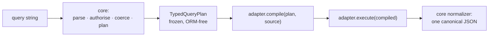

`nestjs-rest-query` separates **what a request means** from **how one ORM
executes it**. The core parses the query string, authorises it against the
endpoint rules, coerces every value by its declared kind and produces a frozen
`TypedQueryPlan`. An adapter only compiles that plan.

## The plan, then the adapter

Two consequences worth stating plainly:

- **Normalisation is the core's job, not the adapter's.** The adapter hydrates
  rows; the core turns them into the canonical JSON. That is the only place
  where PostgreSQL's `bigint`, MySQL's `number` and SQL Server's `string` for
  the same column become the same output.
- **There is no global adapter setting.** `forRoot({ adapter })` is refused at
  startup. The adapter arrives with the source you pass to `execute()`.

## Choosing an adapter

| ORM         | Source factory                                     | Subpath                     | What you declare                                                                                                                       |
| ----------- | -------------------------------------------------- | --------------------------- | -------------------------------------------------------------------------------------------------------------------------------------- |
| **TypeORM** | `typeormSource(repository)`                        | `nestjs-rest-query/typeorm` | The logical schema, or derive it with `buildSchemaRegistry(repository)`. Companion columns follow the `_folded` / `_order` convention. |
| **Prisma**  | `prismaSource({ client, model, manifest })`        | `nestjs-rest-query/prisma`  | The logical schema **and** a hand-written manifest (`provider`, `registry`, `models`).                                                 |
| **Drizzle** | `drizzleSource({ db, dialect, table, relations })` | `nestjs-rest-query/drizzle` | A logical table descriptor plus relations by dotted path; `drizzleDatabase({ client, dialect })` once.                                 |

Only `typeormSource<T>(repository)` is generic in the row type. `prismaSource`
and `drizzleSource` fix it at `object`, so those services annotate
`Promise<NormalizedQueryResult<object>>` — narrowing it further would need a
cast.

## Parity, and how it is measured

The promise is that the same request produces the same observable outcome in
nine combinations — TypeORM, Prisma and Drizzle × PostgreSQL, MySQL and SQL
Server — measured by one corpus with one set of expectations, including
byte-for-byte `400` messages.

SQLite is **not** a matrix cell. It is the reference dialect: it proves each
adapter's compiler implements the plan's semantics, it runs without a container,
and a green result there is not parity.

The current per-cell state, including which gates are still open, is in
[`docs/v3/status.md`](https://github.com/naldomadeira/nestjs-rest-query/blob/main/docs/v3/status.md);
the supported version matrix is in
[`docs/v3/versions.md`](https://github.com/naldomadeira/nestjs-rest-query/blob/main/docs/v3/versions.md).

## Declared divergences and limits

A divergence — same input, different observable outcome by adapter — is allowed
only where the underlying model makes "the same as TypeORM" ambiguous or unsafe.
Each one is declared as data on the corpus case itself, with a mandatory reason,
so an adapter that starts agreeing again breaks the build and forces the
exception to be deleted.

| Adapter     | Case                                                                                                                                                    | Outcome                                                                                                                                                                                                                 |
| ----------- | ------------------------------------------------------------------------------------------------------------------------------------------------------- | ----------------------------------------------------------------------------------------------------------------------------------------------------------------------------------------------------------------------- |
| **Prisma**  | `like`, `notLike`, `ilike`, `notIlike`, `search` on `sqlite` and `sqlserver`                                                                            | Refused, `400 CAPABILITY_UNAVAILABLE`. Prisma compiles `contains` with no `ESCAPE` clause and those two dialects have no default escape character, so `%` and `_` cannot be literal. Works on `postgresql` and `mysql`. |
| **TypeORM** | An existential condition (filter **or** `search`) that crosses a `many` relation and then continues through another relation, e.g. `items.company.name` | Refused, `CAPABILITY_UNAVAILABLE`. Prisma and Drizzle compile it.                                                                                                                                                       |
| **TypeORM** | An existential condition through a **many-to-many** relation                                                                                            | Refused, `CAPABILITY_UNAVAILABLE`. Prisma and Drizzle compile it.                                                                                                                                                       |
| **Drizzle** | Projecting a to-many collection nested under another relation                                                                                           | Refused, `ADAPTER_CONTRACT_VIOLATION`. First-level collections are supported.                                                                                                                                           |
| **Drizzle** | `DrizzleColumn.name`                                                                                                                                    | Declared and **ignored**: the compiler emits the `columns` **key** as the SQL identifier. Keep key and physical column name identical until this is fixed.                                                              |

The two TypeORM rows are an **open gap**, not intended behaviour: a single
`many` hop compiles to a correlated `EXISTS` in all three adapters, and that is
a corpus case. Anything deeper is refused rather than compiled wrong — a
previous revision emitted syntactically valid `EXISTS` against the wrong table
for many-to-many, which is worse.

<Callout type="info">
  The `search` whitelist in
  [`02-app-with-postgres`](https://github.com/naldomadeira/nestjs-rest-query/blob/main/apps/examples/02-app-with-postgres/src/access-requests/access-requests.query.ts)
  is a good illustration: it keeps `user.firstName` (one `one` hop) and leaves
  `items.company.name` out precisely because of the TypeORM limit above, even
  though the same path works under Prisma and Drizzle.
</Callout>

Everything else — filter operators, `search`, pagination shape, `paginate=false`,
the `customize` hook, `isNull` on a `one` or `many` relation, repeated filters,
whitelist rejection, dotted-path filters — is exercised by the parity corpus and
produces identical outcomes across all three adapters.

## Get started

<Cards>
  <Card title="TypeORM" href="/docs/adapters/typeorm" />
  <Card title="Drizzle" href="/docs/adapters/drizzle" />
  <Card title="Prisma" href="/docs/adapters/prisma" />
  <Card title="Writing your own" href="/docs/adapters/writing-your-own" />
</Cards>
