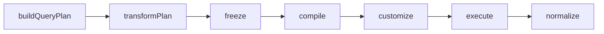

`execute()` takes a fourth, optional argument: an options object with two hooks.

```typescript
execute(source, query, rules, {
  transformPlan?: (plan: TypedQueryPlan) => TypedQueryPlan,
  customize?: (native: TNative) => void,
  customizeScope?: 'data' | 'count' | 'both',   // default 'both'
})
```

In `2.x` the fourth argument was the callback itself. It is an object now,
because there are two different hooks at two different altitudes.

## The pipeline, and where each hook sits



The order is fixed. `transformPlan` is the last point at which the plan can
change; `customize` runs after compilation, on the adapter's native context.
Data and count derive from the same frozen plan, which is why the two queries
always describe the same question.

## `transformPlan` — adapter-agnostic

Use it for policy that belongs to your application and must hold whatever ORM is
behind the source: tenant scoping expressed in plan terms, an internal default,
a forced projection. It receives and returns a `TypedQueryPlan`.

```typescript
await this.queryBuilderService.execute(source, query, rules, {
  // Adapter-agnostic hook: tenant, soft delete, internal policy.
  // Return the plan, or a modified copy of it.
  transformPlan: (plan) => plan,
});
```

<Callout type="warn" title="Return a new plan; do not mutate the one you get">
  The plan handed to `transformPlan` is already **deep-frozen** — every nested
  object, array and `Map` included. Assigning to one of its properties throws a
  `TypeError` under the module system's strict mode, so build a new object and
  return it. The result is frozen again before compilation, which is what stops
  a hook from mutating the plan between the data query and the count query.
</Callout>

Note where it sits: parsing, authorisation and coercion have already happened,
so the plan you receive is a valid one — and the terms you add to it are **not**
re-validated before compilation. A hook that introduces a term the schema cannot
serve is your bug, not a rejected request. Prefer reshaping what the plan
already contains over inventing new terms.

## `customize` — adapter-specific

Use it for capabilities outside the REST contract. It receives the **native
context**, once per query in scope, and what "native" means depends on the
adapter:

| Adapter     | `TNative`                                |
| ----------- | ---------------------------------------- |
| **TypeORM** | the typed `SelectQueryBuilder<T>`        |
| **Prisma**  | `{ kind: 'data' \| 'count', args }`      |
| **Drizzle** | `{ kind: 'data' \| 'count', statement }` |

```typescript title="TypeORM"
await this.queryBuilderService.execute(
  typeormSource(this.userRepository),
  query,
  rules,
  {
    customize: (qb) => {
      qb.andWhere('root.tenant_id = :tenant', { tenant });
    },
  }
);
```

```typescript title="Prisma"
await this.queryBuilderService.execute(
  prismaSource({ client: this.prisma, model: 'user', manifest }),
  query,
  rules,
  {
    customize: (native) => {
      native.args.where = { AND: [native.args.where ?? {}, { tenantId }] };
    },
  }
);
```

```typescript title="Drizzle"
await this.queryBuilderService.execute(
  drizzleSource({ db, dialect: 'postgres', table, relations }),
  query,
  rules,
  {
    customize: (native) => {
      native.statement.where = {
        op: 'and',
        terms: [
          ...(native.statement.where ? [native.statement.where] : []),
          {
            op: 'compare',
            ref: { alias: native.statement.alias, column: 'tenantId' },
            comparator: '=',
            value: tenant,
          },
        ],
      };
    },
  }
);
```

The root alias under TypeORM is `root`.

<Callout type="info">
  The library's public parameters (`filters`, `sorts`, `fields`, `includes`,
  `search`) all speak in **declared field paths**. Inside `customize`, when you
  write SQL as a string, you are past that boundary and use the database's own
  identifiers.
</Callout>

## `customizeScope`

The hook is invoked once per query, not once with both — and that is what makes
the default actually work.

| Scope     | Reaches            | Use when                                                               |
| --------- | ------------------ | ---------------------------------------------------------------------- |
| `'both'`  | data **and** count | Default. Anything that changes which rows qualify.                     |
| `'data'`  | the data query     | Something that cannot appear in a count — and you accept the mismatch. |
| `'count'` | the count query    | Rare; almost always a mistake.                                         |

A single `qb.andWhere(...)` under `'both'` therefore lands on both queries. A
partial scope lets the count answer a different question than the data — so the
library logs a structured warning when you choose one:

```
customize is scoped to a single query; data and count may diverge
```

## When to use what

| Need                                                         | Reach for                              |
| ------------------------------------------------------------ | -------------------------------------- |
| Conditions never exposed to the client (soft delete, tenant) | `customize`, or `transformPlan`        |
| Filtering by the authenticated user                          | `customize`, or `transformPlan`        |
| Database-specific full-text search                           | `customize`                            |
| A filter the client should control                           | a `filters` rule in `defineQueryRules` |
| A quick search box over several fields                       | `search` in `defineQueryRules`         |
| Relation loading                                             | `includes` in `defineQueryRules`       |

## Native text search

`search` is a first-class parameter, not something to build in `customize`.
Declare the searchable paths in the rules and send `?search=term`:

```typescript
export const userRules = defineQueryRules(USER_SCHEMAS, 'user', {
  // ...
  search: ['name', 'email', 'company.name'],
});
```

The targets are combined with `OR`, each compared through its **folded column**,
against the term normalised by the same `foldText`. So no `ILIKE` is emitted, and
the result does not depend on the server's collation. A target that crosses one
`many` relation compiles to a correlated `EXISTS`, so the page keeps its size and
`total` keeps counting root rows.

Two constraints are worth repeating here: a `search` path needs a `foldedField`
or the application does not boot, and folding does **not** strip diacritics. See
[Endpoint whitelist rules](/docs/usage/endpoint-whitelist-rules).

### `search` versus `filter`

|                        | `filter[name][like]=john`            | `search=john`           |
| ---------------------- | ------------------------------------ | ----------------------- |
| Who picks the field    | the client                           | the backend             |
| Whitelisted            | yes, per field + operator            | yes, via `search`       |
| Several fields at once | not directly                         | yes, combined with `OR` |
| Case sensitivity       | `like` is literal; `ilike` is folded | always folded           |

Still reach for `customize` when search has to deviate from that: per-field
weights, `AND` between term groups, a database-specific full-text index, or rules
that depend on tenant, role or authentication context.

## Inspecting the plan

There is no `buildQuery()` in v3 — nothing hands you a half-built
`SelectQueryBuilder`, because the plan is the ORM-free artefact and each adapter
compiles it. What exists is `buildPlan`, which stops right after
`transformPlan` and the freeze:

```typescript
const plan = this.queryBuilderService.buildPlan(query, rules, {
  transformPlan: (p) => p,
});
```

It is the seam to assert on in tests, or to inspect when a request does not
produce the SQL you expected. To reach the ORM's own builder, use `customize`.
