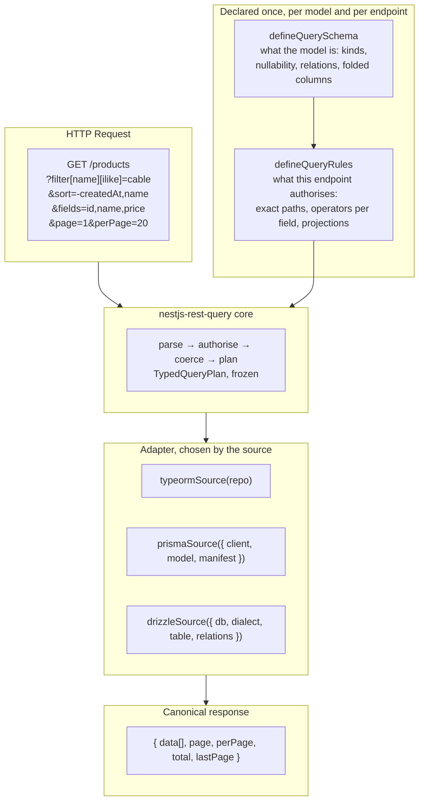

<Callout type="warn" title="These pages describe v3, which is not published yet">

The `3.x` API described on this site is implemented in the repository, exercised
by four example applications and by a nine-cell parity matrix, but the latest
version on npm is still `2.1.0`. The remaining release gates are listed in
[`docs/v3/status.md`](https://github.com/naldomadeira/nestjs-rest-query/blob/main/docs/v3/status.md).
If you are on `2.x` today, read
[the migration guide](https://github.com/naldomadeira/nestjs-rest-query/blob/main/MIGRATION.md#2x--3x)
before upgrading — v3 has no compatibility mode.

</Callout>

**`nestjs-rest-query`** turns HTTP query parameters — filters, sorts,
pagination, field selection, relation loading and text search — into a typed
query plan, authorises that plan against a per-endpoint whitelist, and lets an
ORM adapter compile it. TypeORM, Prisma and Drizzle are supported by the same
core, and are meant to answer the same request the same way.

## Main flow



The endpoint's compiled rules are the single source for two things at once:
authorisation at runtime, and the OpenAPI parameters `@ApiDynamicQuery(rules)`
generates. They cannot drift apart, because they are not two declarations.

## What v3 changed

If you know the `2.x` API, four things are different in kind, not in degree:

- **The schema is declared, not guessed.** A field's declared `kind` decides how
  the incoming text is coerced, so `"00430123"` stays the string `"00430123"`
  instead of becoming the number `430123`.
- **The adapter comes from the source, not from `forRoot`.** The root package
  loads no ORM; `forRoot({ adapter })` is rejected at startup.
- **Whitelists match exact paths.** Authorising the relation `company` no longer
  authorises `company.name`.
- **Impossible configurations fail when the application boots**, not on the
  first request that happens to hit them.

## Features

- **Dynamic filters** — 14 operators (`eq`, `ne`, `like`, `ilike`, `notLike`,
  `notIlike`, `gt`, `gte`, `lt`, `lte`, `in`, `notIn`, `between`, `isNull`),
  authorised per field
- **Sorts** — multi-column, `-` for descending, refused where the ordering would
  not be portable across databases
- **Pagination** — `page`/`perPage` with `total` and `lastPage`, or
  `paginate=false`
- **Field selection** — `fields=`, constrained by a declared projection per
  level
- **Relation loading** — `includes=`, each relation with its own field
  projection
- **Portable text search** — `search=` over pre-normalised (folded) columns, so
  the same request returns the same rows regardless of the server collation
- **Stable error envelope** — every rejection carries a machine-readable `code`
- **Three ORM adapters** behind one core, plus a parity corpus that compares
  them

## Minimal endpoint

Two declarations and one call. This is
[`apps/examples/01-starter-app`](https://github.com/naldomadeira/nestjs-rest-query/tree/main/apps/examples/01-starter-app),
trimmed:

```typescript title="product.query.ts"
import { defineQueryRules, defineQuerySchema } from 'nestjs-rest-query';
import type { QuerySchema, SchemaRegistry } from 'nestjs-rest-query';

const productSchema: QuerySchema = defineQuerySchema({
  model: 'product',
  primaryKey: ['id'],
  fields: [
    { path: 'id', kind: 'integer', nullable: false, primaryKey: true },
    {
      path: 'name',
      kind: 'string',
      nullable: false,
      primaryKey: false,
      foldedField: 'name_folded',
    },
    {
      path: 'name_folded',
      kind: 'string',
      nullable: false,
      primaryKey: false,
      internal: true,
    },
    { path: 'price', kind: 'decimal', nullable: false, primaryKey: false },
    { path: 'createdAt', kind: 'datetime', nullable: false, primaryKey: false },
  ],
  relations: [],
});

export const PRODUCT_SCHEMAS: SchemaRegistry = new Map([
  ['product', productSchema],
]);

export const productRules = defineQueryRules(PRODUCT_SCHEMAS, 'product', {
  filters: [
    { path: 'id', operators: ['eq', 'in'] },
    { path: 'name', operators: ['eq', 'like', 'ilike'] },
    { path: 'price', operators: ['eq', 'gt', 'gte', 'lt', 'lte', 'between'] },
  ],
  sorts: ['id', 'name', 'price', 'createdAt'],
  fields: {
    root: {
      allowed: ['id', 'name', 'price', 'createdAt'],
      default: ['id', 'name', 'price', 'createdAt'],
    },
  },
  search: ['name'],
});
```

```typescript title="product.controller.ts"
@Get()
@ApiDynamicQuery(productRules)
async findAll(
  @Query() query: DynamicQueryDto,
  @QueryRules() rules: CompiledQueryRules,
) {
  return this.productService.findAll(query, rules);
}
```

```typescript title="product.service.ts"
import { typeormSource } from 'nestjs-rest-query/typeorm';

async findAll(
  query: DynamicQueryDto,
  rules: CompiledQueryRules,
): Promise<NormalizedQueryResult<Product>> {
  return this.queryBuilderService.execute(
    typeormSource(this.productRepository),
    query,
    rules,
  );
}
```

`productRules` is built at module load, outside the class, because
`@ApiDynamicQuery` is a method decorator and runs before Nest has a container or
a repository.

## Get started

<Cards>
  <Card
    title="NestJS Prerequisite"
    href="/docs/getting-started/prerequisites"
  />
  <Card title="Installation" href="/docs/getting-started/installation" />
  <Card title="First endpoint" href="/docs/getting-started/first-endpoint" />
  <Card title="Adapters" href="/docs/adapters" />
  <Card title="Swagger" href="/docs/swagger" />
  <Card title="Customizing the Query" href="/docs/advanced/customizing" />
</Cards>
