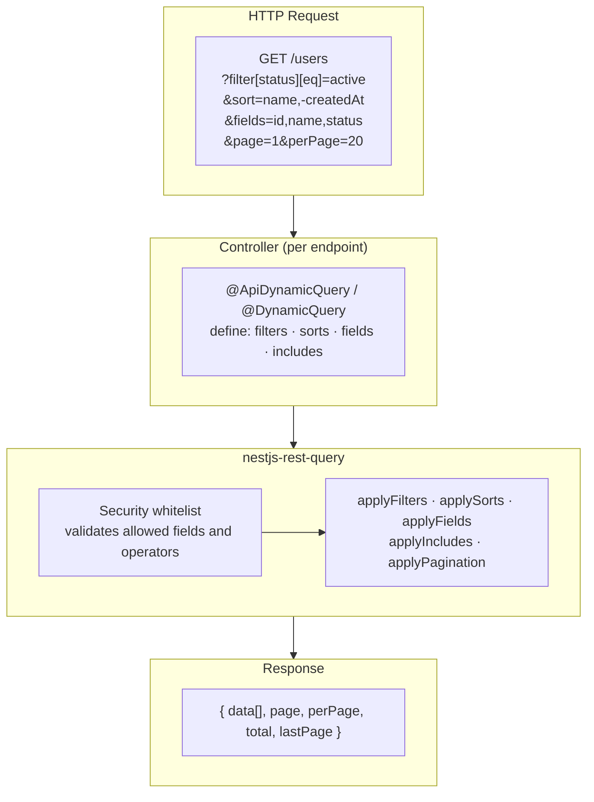

<Callout type="warn" title="These docs describe v2">

The examples below still use the v2 API — `RulesConfig`, adapter classes from
the root entrypoint, and coercion driven by how a value looks. **v3 replaces
all three.** Rewriting this site is phase 7 of the v3 plan; until then, the
authoritative description of the current API is
[the v2 → v3 migration guide](https://github.com/naldomadeira/nestjs-rest-query/blob/main/docs/migration/v2-to-v3.md).

</Callout>

**`nestjs-rest-query`** is a NestJS library that builds TypeORM `SelectQueryBuilder` instances dynamically from HTTP query parameters — filters, sorts, pagination, field selection, and relation loading — all controlled by a per-endpoint security whitelist.

## Main flow



Each endpoint declares its own whitelist via `@ApiDynamicQuery` (with OpenAPI) or `@DynamicQuery` (without it). At runtime, `QueryBuilderService` validates the received parameters against that whitelist, applies each handler, and returns the already paginated result.

## Features

- **Dynamic filters** — filter by any allowed field using operators like `eq`, `like`, `in`, `between`, `isNull`, and more
- **Sorts** — multi-column sorting with `ASC` / `DESC`, controlled per endpoint
- **Pagination** — page-based or limit/offset, with `page`, `perPage`, `total`, and `lastPage` at the top of the response
- **Field selection** — return only the columns the client needs
- **Relation loading** — load TypeORM relations declared in your whitelist
- **Security whitelist** — the `@ApiDynamicQuery` / `@DynamicQuery` decorators define exactly which fields and operators each endpoint allows
- **Swagger integration** — `@ApiDynamicQuery` automatically generates `@ApiQuery` decorators for all supported query parameters
- **Fully typed** — written in TypeScript, with complete type definitions

## How it works

1. Decorate your controller method with `@ApiDynamicQuery(rules)` (or `@DynamicQuery(rules)`)
2. Add `@QueryRules()` as a parameter decorator to receive the rules at runtime
3. Call `queryBuilderService.execute(repo, query, rules)` — the library applies filters, sorts, pagination, and relations, returning the results with pagination data at the top of the response

```typescript
@Get()
@ApiDynamicQuery({
  filters: ['name', 'status', 'createdAt'],
  sorts: ['name', 'createdAt'],
  includes: ['company'],
})
findAll(
  @Query() query: DynamicQueryDto,
  @QueryRules() rules: RulesConfig,
) {
  return this.queryBuilderService.execute(this.repo, query, rules);
}
```

## Get started

<Cards>
  <Card
    title="NestJS Prerequisite"
    href="/docs/getting-started/prerequisites"
  />
  <Card title="Installation" href="/docs/getting-started/installation" />
  <Card title="First endpoint" href="/docs/getting-started/first-endpoint" />
  <Card title="Swagger" href="/docs/swagger" />
  <Card title="Customizing the Query" href="/docs/advanced/customizing" />
</Cards>
