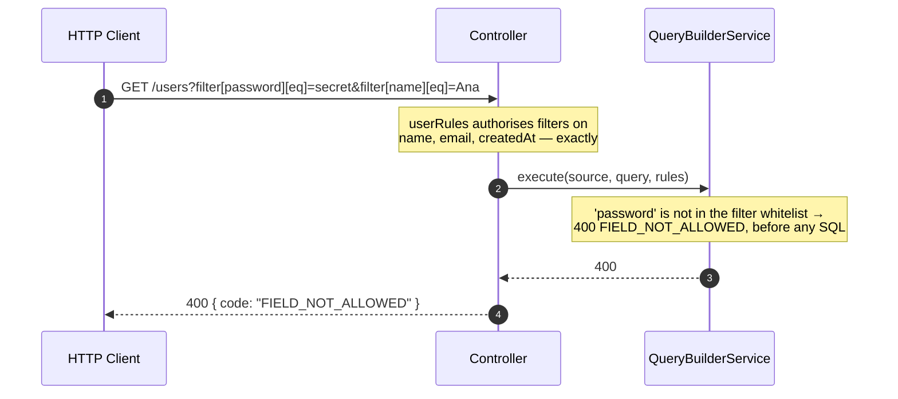

If you do not have a working endpoint yet, start with
[First endpoint](/docs/getting-started/first-endpoint). This page is the
reference for the decorators, the wire format and the two envelopes. The rules
themselves have their own page:
[Endpoint whitelist rules](/docs/usage/endpoint-whitelist-rules).

## Decorators

### `@ApiDynamicQuery(rules)`

Method decorator for endpoints that need OpenAPI documentation. It does two
things at once:

- stores the **compiled rules** on the method, where `@QueryRules()` reads them
  at runtime;
- generates `@ApiQuery` for the parameters this endpoint actually supports —
  `page`, `perPage`, `paginate` always, and `sort`, `fields`, `includes`,
  `search` and `filter` only when the rules declare something for them.

```typescript
@Get()
@ApiDynamicQuery(userRules)
async findAll(/* ... */) {}
```

It takes the object `defineQueryRules(...)` returned. **It is not generic** — a
leftover `@ApiDynamicQuery<User>(...)` gives
`TS2558: Expected 0 type arguments, but got 1`.

<Callout type="warn">
  The decorator is evaluated when the controller class loads, before Nest has a
  container or a repository. Compile the rules at module scope, in their own
  file, not inside the class.
</Callout>

### `@DynamicQuery(rules)`

Same registration, **no OpenAPI generation**. Use it for internal endpoints or
when `@nestjs/swagger` is not installed.

### `@QueryRules()`

**Parameter** decorator that reads the rules registered by `@ApiDynamicQuery` or
`@DynamicQuery` on the same method and injects them as an argument.

```typescript
async findAll(
  @Query() query: DynamicQueryDto,
  @QueryRules() rules: CompiledQueryRules,
) {}
```

`@QueryRules()` depends on one of the method decorators being present. Without
it there are no rules to hand over.

## Complete controller

```typescript title="users.controller.ts"
import { Controller, Get, Query } from '@nestjs/common';
import { ApiOperation, ApiTags } from '@nestjs/swagger';
import {
  ApiDynamicQuery,
  ApiPaginatedResponse,
  DynamicQueryDto,
  QueryRules,
  type CompiledQueryRules,
  type NormalizedQueryResult,
} from 'nestjs-rest-query';
import { User } from './entities/user.entity';
import { UsersBusiness } from './users.business';
import { userRules } from './users.query';

@ApiTags('users')
@Controller('users')
export class UsersController {
  constructor(private readonly usersBusiness: UsersBusiness) {}

  @Get()
  @ApiOperation({ summary: 'List users with dynamic filters' })
  @ApiDynamicQuery(userRules)
  @ApiPaginatedResponse(User, { description: 'User list' })
  async findAll(
    @Query() query: DynamicQueryDto,
    @QueryRules() rules: CompiledQueryRules
  ): Promise<NormalizedQueryResult<User>> {
    return this.usersBusiness.findAll(query, rules);
  }
}
```

## Service

Inject `QueryBuilderService` and your repository/client normally. The module is
`@Global`, so the service is available in any provider without importing
`DynamicQueryBuilderModule` again.

```typescript title="users.business.ts"
import { typeormSource } from 'nestjs-rest-query/typeorm';

@Injectable()
export class UsersBusiness {
  constructor(
    @InjectRepository(User)
    private readonly userRepository: Repository<User>,
    private readonly queryBuilderService: QueryBuilderService
  ) {}

  async findAll(
    query: DynamicQueryDto,
    rules: CompiledQueryRules
  ): Promise<NormalizedQueryResult<User>> {
    return this.queryBuilderService.execute(
      typeormSource(this.userRepository),
      query,
      rules
    );
  }
}
```

`execute(source, query, rules, options?)` takes a **source**, not a repository.
See [Adapters](/docs/adapters) for the three source factories and
[Customizing the Query](/docs/advanced/customizing) for `options`.

## Supported query parameters

| Parameter  | Format                         | Example                                |
| ---------- | ------------------------------ | -------------------------------------- |
| `filter`   | `filter[path][operator]=value` | `filter[email][eq]=ana@example.com`    |
| `sort`     | list of paths, `-` for desc    | `sort=-createdAt,name`                 |
| `fields`   | list of paths                  | `fields=id,name,company.name`          |
| `includes` | list of relation paths         | `includes=company,posts`               |
| `search`   | free text                      | `search=ana`                           |
| `page`     | positive integer               | `page=2`                               |
| `perPage`  | positive integer               | `perPage=25`                           |
| `paginate` | `true` / `false` / `1` / `0`   | `paginate=false` (returns only `data`) |

Notes that are easy to get wrong:

- **A parameter outside this table is a `400`**, not a silent no-op:
  `QUERY_SYNTAX_UNKNOWN_PARAM`, with the key name in `details.param` and never
  the value. A `?utm_source=`, a cache-busting `?_=`, a middleware's `?lang=` —
  all refused. Strip them before the query reaches the DTO.
- The parameter is `sort`, singular. The **rules** property is `sorts`.
- `filter[name]=Ada` is the short form of `filter[name][eq]=Ada`.
- Lists accept a repeated/array parameter (preferred, `qs` expands it) or CSV.
  CSV supports quoting and backslash escapes, so `filter[name][in]="A, B"` is
  one item and not two.
- `page`/`perPage` want a plain positive decimal integer. `?page=` (present and
  empty) is a `400`, not a fallback to page 1.
- A `perPage` above `maxPerPage` is a `400`, not a silent clamp.
- A path must be authorised **exactly**. `fields=company.name` also requires
  `company` in `includes`, on the request as well as in the rules — selection
  never pulls a relation in implicitly.

### Filter operators

All 14, in the order the library lists them:

| Operator   | Meaning                                      | Applies to                                             |
| ---------- | -------------------------------------------- | ------------------------------------------------------ |
| `eq`       | equal                                        | any non-opaque kind                                    |
| `ne`       | not equal                                    | any non-opaque kind                                    |
| `like`     | contains, literal pattern                    | `string`, `uuid`, `enum`                               |
| `ilike`    | contains, case-folded                        | `string`, `uuid`, `enum` **with a `foldedField`**      |
| `notLike`  | does not contain, literal pattern            | `string`, `uuid`, `enum`                               |
| `notIlike` | does not contain, case-folded                | `string`, `uuid`, `enum` **with a `foldedField`**      |
| `gt`       | greater than                                 | kinds with a portable order, or a `portableOrderField` |
| `gte`      | greater than or equal                        | idem                                                   |
| `lt`       | less than                                    | idem                                                   |
| `lte`      | less than or equal                           | idem                                                   |
| `in`       | in a list                                    | any non-opaque kind                                    |
| `notIn`    | not in a list                                | any non-opaque kind                                    |
| `between`  | between two values, inclusive                | kinds with a portable order, or a `portableOrderField` |
| `isNull`   | `IS NULL` (`true`) / `IS NOT NULL` (`false`) | **nullable** fields, and relations                     |

`json` and `binary` are opaque: no operator is inferred for them.

Four behaviours to know:

- **`%`, `_` and `\` are literal.** `filter[name][like]=100%` searches for the
  text "100%". Under Prisma on `sqlite`/`sqlserver` that promise cannot be kept,
  so those five pattern operators are refused there — see
  [Prisma adapter](/docs/adapters/prisma).
- **`in=[]` returns zero rows** (an always-false condition) and **`notIn=[]`
  returns everything**. In `2.x` an empty `in` was ignored.
- **`between` needs exactly two values**, otherwise
  `400 FILTER_VALUE_INVALID`.
- **`isNull` on a relation** asks about the relation itself:
  `filter[company][isNull]=true` finds rows with no company, and on a `many`
  relation it means "empty collection" — compiled as `NOT EXISTS`, never as a
  join.

### Value coercion, by declared kind

Coercion follows the field's `kind`, never the shape of the text. This is the
single biggest observable change from `2.x`, where `"00430123"` became
`430123`.

| Kind       | Accepted input                                                     |
| ---------- | ------------------------------------------------------------------ |
| `string`   | any string, **not trimmed** — a space is part of the value         |
| `uuid`     | a canonical UUID                                                   |
| `enum`     | a declared member                                                  |
| `integer`  | a decimal integer, no leading zeros, within the safe integer range |
| `bigint`   | a decimal integer, carried as `bigint`                             |
| `decimal`  | a canonical finite decimal, kept exact — never a float             |
| `boolean`  | `true`, `false`, `1`, `0`                                          |
| `date`     | `YYYY-MM-DD`, and it has to be a real calendar date                |
| `datetime` | ISO 8601 **with an offset or `Z`** — a naive timestamp is rejected |

Anything else is `400 FILTER_VALUE_INVALID`, and `details` never echoes the
value the client sent.

## The response envelope

```json
{
  "data": [
    { "id": 1, "name": "Ana Lima", "email": "ana@example.com" },
    { "id": 2, "name": "Bruno Costa", "email": "bruno@example.com" }
  ],
  "page": 1,
  "perPage": 20,
  "total": 42,
  "lastPage": 3
}
```

With `paginate=false` the response is `{ "data": [...] }` and nothing else.
`lastPage` is never `0` — the contract promises at least `1`.

The core, not the adapter, produces this JSON. Two consequences:

- **Output encoding is uniform.** `bigint` and `decimal` are serialised as
  strings, `datetime` as an ISO instant, `date` as `YYYY-MM-DD`, `binary` as
  base64 — regardless of whether the driver handed back a string, a number or a
  `Date`.
- **Internal columns never appear**, and a primary key that is not part of the
  visible projection is removed even though the adapter had to select it for
  hydration, dedupe and pagination.

## The error envelope

```json
{
  "statusCode": 400,
  "code": "FIELD_NOT_ALLOWED",
  "message": "filter path is not allowed: secret",
  "details": { "path": "secret", "scope": "filter", "allowed": ["id", "name"] }
}
```

Branch on `code`, never on `message`.

| Code                           | Status     | When                                                                                                                                                                              |
| ------------------------------ | ---------- | --------------------------------------------------------------------------------------------------------------------------------------------------------------------------------- |
| `QUERY_SYNTAX_INVALID`         | 400        | a path or operator outside the safe alphabet, a malformed list                                                                                                                    |
| `QUERY_SYNTAX_UNKNOWN_PARAM`   | 400        | a query parameter outside the eight-name grammar; `details.param` is the key, never the value                                                                                     |
| `FIELD_NOT_ALLOWED`            | 400        | the path is not in that scope's whitelist                                                                                                                                         |
| `FIELD_NOT_FOUND`              | 400        | the path is whitelisted but does not exist on the schema                                                                                                                          |
| `RELATION_NOT_FOUND`           | 400        | a relation hop in the path does not exist                                                                                                                                         |
| `OPERATOR_NOT_ALLOWED`         | 400        | the field does not authorise that operator                                                                                                                                        |
| `OPERATOR_TYPE_MISMATCH`       | 400        | the operator makes no sense for that kind — `like` on an integer, `sort` through a `many` relation                                                                                |
| `FILTER_VALUE_INVALID`         | 400        | the value does not decode for the declared kind                                                                                                                                   |
| `PAGINATION_INVALID`           | 400        | `page`, `perPage` or `paginate` is not a valid literal, or exceeds `maxPerPage`                                                                                                   |
| `SORT_CONFLICT`                | 400        | the same path was requested ascending and descending                                                                                                                              |
| `CAPABILITY_UNAVAILABLE`       | 400 or 500 | the operator or shape cannot be served: no folded column, no portable order, Prisma patterns on `sqlite`/`sqlserver` (400); a primary key with no portable order (500)            |
| `PORTABILITY_PROFILE_MISMATCH` | 500        | `portability.enforce` is on and the source's profile facts do not match                                                                                                           |
| `SOURCE_CONFIGURATION_INVALID` | 500        | the declared schema does not match the source, or `forRoot` got a removed key or a value no adapter implements (`textProfile: 'database-native'`, `consistency: 'transactional'`) |
| `ADAPTER_CONTRACT_VIOLATION`   | 500        | the adapter cannot compile a shape the plan asked for                                                                                                                             |

The split is deliberate: client input is `400`, and a mistake in your
declaration is `500`, because it is a bug in the application, not in the
request. Most configuration errors surface while the application boots rather
than on a request.

## How the whitelist protects the endpoint



Nothing reaches the database until every path and operator has been authorised.

## Next steps

<Cards>
  <Card
    title="Endpoint whitelist rules"
    href="/docs/usage/endpoint-whitelist-rules"
  />
  <Card title="Adapters" href="/docs/adapters" />
  <Card title="Swagger" href="/docs/swagger" />
  <Card title="Customizing the Query" href="/docs/advanced/customizing" />
</Cards>
