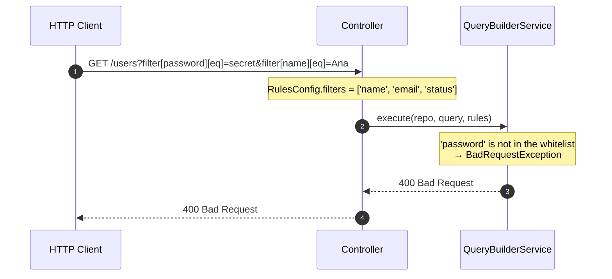

If you do not have a working endpoint yet, start with [First endpoint](/docs/getting-started/first-endpoint). This page is the reference for decorators, parameters, operators, and the security whitelist.

## Decorators

### `@ApiDynamicQuery(rules)`

Method decorator for endpoints that need Swagger documentation. It does two things simultaneously:

- Stores `RulesConfig` as metadata on the method (read by `@QueryRules()` at runtime)
- Automatically generates `@ApiQuery` for all supported parameters (filters, sort, fields, includes, page, perPage)

```typescript
@Get()
@ApiDynamicQuery({
  filters: ['name', 'email', 'createdAt'],
  sorts: ['name', 'createdAt'],
  fields: ['id', 'name', 'email', 'createdAt'],
  includes: ['company'],
})
async findAll(/* ... */) {}
```

### `@DynamicQuery(rules)`

Identical to `@ApiDynamicQuery`, but **without Swagger generation**. Use it for internal endpoints or when `@nestjs/swagger` is not installed.

```typescript
@Get()
@DynamicQuery({
  filters: ['name', 'status'],
  sorts: ['name'],
})
async findAll(/* ... */) {}
```

### `@QueryRules()`

**Parameter** decorator that reads the `RulesConfig` stored by `@ApiDynamicQuery` or `@DynamicQuery` and injects it as a method argument at runtime.

```typescript
async findAll(
  @Query() query: DynamicQueryDto,
  @QueryRules() rules: RulesConfig,  // reads the whitelist from the method decorator
) {}
```

<Callout type="warn">
  `@QueryRules()` depends on the metadata generated by `@ApiDynamicQuery` or
  `@DynamicQuery` on the same method. Without one of those decorators, `rules`
  will be `{}`.
</Callout>

## Complete controller

```typescript title="users.controller.ts"
import { Controller, Get, Query } from '@nestjs/common';
import { ApiTags, ApiOperation } from '@nestjs/swagger';
import {
  ApiDynamicQuery,
  ApiPaginatedResponse,
  DynamicQueryDto,
  QueryResult,
  QueryRules,
  RulesConfig,
} from 'nestjs-rest-query';
import { User } from './entities/user.entity';
import { UsersBusiness } from './users.business';

@ApiTags('users')
@Controller('users')
export class UsersController {
  constructor(private readonly usersBusiness: UsersBusiness) {}

  @Get()
  @ApiOperation({ summary: 'Lista usuários com filtros dinâmicos' })
  @ApiDynamicQuery({
    filters: ['username', 'email', 'firstName', 'lastName', 'createdAt'],
    sorts: ['username', 'email', 'createdAt'],
    fields: ['id', 'username', 'email', 'firstName', 'lastName', 'createdAt'],
  })
  @ApiPaginatedResponse(User)
  async findAll(
    @Query() query: DynamicQueryDto,
    @QueryRules() rules: RulesConfig
  ): Promise<QueryResult<User>> {
    return this.usersBusiness.findAll(query, rules);
  }
}
```

## Service

Inject `QueryBuilderService` and the `Repository` normally through NestJS dependency injection. Since the module is `@Global`, the service is available in any provider without importing `DynamicQueryBuilderModule` again.

```typescript title="users.business.ts"
import { Injectable } from '@nestjs/common';
import { InjectRepository } from '@nestjs/typeorm';
import { Repository } from 'typeorm';
import {
  DynamicQueryDto,
  QueryBuilderService,
  QueryResult,
  RulesConfig,
} from 'nestjs-rest-query';
import { User } from './entities/user.entity';

@Injectable()
export class UsersBusiness {
  constructor(
    @InjectRepository(User)
    private readonly userRepository: Repository<User>,
    private readonly queryBuilderService: QueryBuilderService
  ) {}

  async findAll(
    query: DynamicQueryDto,
    rules: RulesConfig
  ): Promise<QueryResult<User>> {
    return this.queryBuilderService.execute(this.userRepository, query, rules);
  }
}
```

## Supported query parameters

| Parameter  | Format                          | Example                                |
| ---------- | ------------------------------- | -------------------------------------- |
| `filter`   | `filter[field][operator]=value` | `filter[email][eq]=joao@email.com`     |
| `sort`     | CSV of fields (`-` for desc)    | `sort=-createdAt,name`                 |
| `fields`   | CSV list                        | `fields=id,name,email`                 |
| `includes` | CSV list                        | `includes=company,roles`               |
| `page`     | number                          | `page=2`                               |
| `perPage`  | number                          | `perPage=25`                           |
| `paginate` | `true` / `false`                | `paginate=false` (returns all records) |

### Available filter operators

| Operator  | Description                           | Example                                            |
| --------- | ------------------------------------- | -------------------------------------------------- |
| `eq`      | Equal                                 | `filter[status][eq]=active`                        |
| `ne`      | Not equal                             | `filter[status][ne]=inactive`                      |
| `gt`      | Greater than                          | `filter[age][gt]=18`                               |
| `gte`     | Greater than or equal                 | `filter[age][gte]=18`                              |
| `lt`      | Less than                             | `filter[price][lt]=100`                            |
| `lte`     | Less than or equal                    | `filter[price][lte]=100`                           |
| `like`    | Contains (case-sensitive)             | `filter[name][like]=John`                          |
| `ilike`   | Contains (case-insensitive, portable) | `filter[name][ilike]=joao`                         |
| `in`      | In a list (CSV)                       | `filter[status][in]=active,pending`                |
| `notIn`   | Not in a list (CSV)                   | `filter[status][notIn]=deleted`                    |
| `between` | Between two values (`val1,val2`)      | `filter[createdAt][between]=2024-01-01,2024-12-31` |
| `isNull`  | Null (`true`) or not null (`false`)   | `filter[deletedAt][isNull]=true`                   |

## Paginated response

`execute()` returns `Promise<QueryResult<T>>`. When pagination is active (default), the response includes pagination data at the top:

```json
{
  "data": [
    { "id": 1, "name": "Ana Lima", "email": "ana@email.com" },
    { "id": 2, "name": "Bruno Costa", "email": "bruno@email.com" }
  ],
  "page": 1,
  "perPage": 10,
  "total": 42,
  "lastPage": 5
}
```

When `paginate=false`, the response contains only `{ "data": [...] }`.

## RulesConfig — security whitelist

Each endpoint defines its own whitelist through `RulesConfig`. Fields not listed in the whitelist result in `400 Bad Request` — the library never executes unauthorized filters, sorts, or includes.

| Property   | Type       | Description                                                                        |
| ---------- | ---------- | ---------------------------------------------------------------------------------- |
| `filters`  | `string[]` | Fields that can be used in `filter[field][op]`.                                    |
| `sorts`    | `string[]` | Fields that can be used in `sort=field` or `sort=-field`.                          |
| `fields`   | `string[]` | Fields that can be selected via `fields=`. Also restricts sort fields (see below). |
| `includes` | `string[]` | TypeORM relations that can be loaded via `includes=`.                              |
| `alias`    | `string`   | Entity alias in QueryBuilder. Default: `'root'`.                                   |

<Callout type="warn">
  **Warning:** when `fields` is defined, it also restricts the fields in
  `sorts`. A field present in `sorts` but missing from `fields` will be
  rejected. To avoid this, keep `fields` and `sorts` in sync — or omit `fields`
  if you do not need to restrict column selection.
</Callout>

`RulesConfig.operators` can narrow the accepted filter operators for one endpoint:

```typescript
@ApiDynamicQuery({
  filters: ['name', 'status'],
  operators: { allowed: ['eq', 'ilike'] },
})
```

This endpoint setting takes precedence over the global `DynamicQueryBuilderModule.forRoot({ operators })` config.

### How the whitelist protects the endpoint



When an unauthorized field is used in `filter`, `sort`, or `includes`, the response is:

```json
{
  "message": "Filter field(s) not allowed: password. Allowed fields: username, email, firstName, lastName, createdAt",
  "error": "Bad Request",
  "statusCode": 400
}
```

## Next steps

<Cards>
  <Card title="First endpoint" href="/docs/getting-started/first-endpoint" />
  <Card title="Swagger" href="/docs/swagger" />
  <Card title="Customizing the Query" href="/docs/advanced/customizing" />
</Cards>
