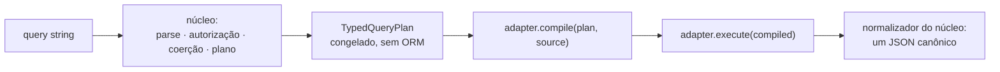

O `nestjs-rest-query` separa **o que uma requisição significa** de **como um ORM
a executa**. O núcleo faz o parse da query string, autoriza contra as regras do
endpoint, coage cada valor pelo tipo declarado e produz um `TypedQueryPlan`
congelado. O adapter apenas compila esse plano.

## O plano, depois o adapter

Duas consequências que vale dizer sem rodeio:

- **Normalizar é trabalho do núcleo, não do adapter.** O adapter hidrata as
  linhas; o núcleo as transforma no JSON canônico. É o único ponto onde o
  `bigint` do PostgreSQL, o `number` do MySQL e a `string` do SQL Server para a
  mesma coluna viram a mesma saída.
- **Não existe configuração global de adapter.** `forRoot({ adapter })` é
  recusado na inicialização. O adapter chega junto com a source que você passa
  ao `execute()`.

## Escolhendo um adapter

| ORM         | Fábrica da source                                  | Subpath                     | O que você declara                                                                                                                   |
| ----------- | -------------------------------------------------- | --------------------------- | ------------------------------------------------------------------------------------------------------------------------------------ |
| **TypeORM** | `typeormSource(repository)`                        | `nestjs-rest-query/typeorm` | O schema lógico, ou derive-o com `buildSchemaRegistry(repository)`. As colunas companheiras seguem a convenção `_folded` / `_order`. |
| **Prisma**  | `prismaSource({ client, model, manifest })`        | `nestjs-rest-query/prisma`  | O schema lógico **e** um manifesto escrito à mão (`provider`, `registry`, `models`).                                                 |
| **Drizzle** | `drizzleSource({ db, dialect, table, relations })` | `nestjs-rest-query/drizzle` | Um descritor lógico da tabela mais as relações por path pontuado; `drizzleDatabase({ client, dialect })` uma vez.                    |

As três fábricas são genéricas no tipo da linha. O
`typeormSource<T>(repository)` infere `T` do repositório; o
`drizzleSource<TRow>` recebe o tipo do executor que você montou com
`drizzleDatabase<TRow>({ ... })`, então também sai por inferência; o
`prismaSource<TRow>` é o único que você nomeia explicitamente. Um serviço pode
anotar `Promise<NormalizedQueryResult<UserDto>>` sem cast em lugar nenhum.

## Paridade, e como ela é medida

A promessa é que a mesma requisição produza o mesmo resultado observável em nove
combinações — TypeORM, Prisma e Drizzle × PostgreSQL, MySQL e SQL Server —
medidas por um corpus único com um conjunto único de expectativas, incluindo
mensagens `400` byte a byte.

O SQLite **não** é célula da matriz. Ele é o dialeto de referência: prova que o
compilador de cada adapter implementa a semântica do plano, roda sem container,
e um verde ali não é paridade.

O estado atual por célula, incluindo quais gates seguem abertos, está em
[`docs/v3/status.md`](https://github.com/naldomadeira/nestjs-rest-query/blob/main/docs/v3/status.md);
a matriz de versões suportadas está em
[`docs/v3/versions.md`](https://github.com/naldomadeira/nestjs-rest-query/blob/main/docs/v3/versions.md).

## Divergências e limites declarados

Divergência — mesma entrada, resultado observável diferente por adapter — só é
permitida onde o modelo subjacente torna "igual ao TypeORM" ambíguo ou inseguro.
Cada uma fica declarada como dado no próprio caso do corpus, com justificativa
obrigatória, então um adapter que volte a concordar quebra o build e força a
remoção da exceção.

| Adapter     | Caso                                                                       | Resultado                                                                                                                                                                                                                        |
| ----------- | -------------------------------------------------------------------------- | -------------------------------------------------------------------------------------------------------------------------------------------------------------------------------------------------------------------------------- |
| **Prisma**  | `like`, `notLike`, `ilike`, `notIlike`, `search` em `sqlite` e `sqlserver` | Recusado, `400 CAPABILITY_UNAVAILABLE`. O Prisma compila `contains` sem cláusula `ESCAPE` e esses dois dialetos não têm caractere de escape default, então `%` e `_` não podem ser literais. Funciona em `postgresql` e `mysql`. |
| **Drizzle** | Projetar uma coleção `many` aninhada sob outra relação                     | Recusado, `ADAPTER_CONTRACT_VIOLATION`. Coleções de primeiro nível são suportadas.                                                                                                                                               |

Condição existencial **não** está nessa lista. Um filtro ou alvo de `search`
que atravessa uma relação `many` compila nos três adapters em qualquer
profundidade — um salto, mais um salto `one` (`posts.author.name`), uma segunda
coleção, ou uma **many-to-many** (`posts.tags.label`) —, e cada uma dessas
formas é caso de corpus sem divergência declarada. O TypeORM emite **um**
`EXISTS` correlacionado ao root uma só vez, com os saltos seguintes como
`INNER JOIN` dentro da subconsulta; na many-to-many o `FROM` da subconsulta é a
tabela de junção, e o alvo entra por join a partir dela.

<Callout type="info">
  A whitelist de `search` do
  [`02-app-with-postgres`](https://github.com/naldomadeira/nestjs-rest-query/blob/main/apps/examples/02-app-with-postgres/src/access-requests/access-requests.query.ts)
  ilustra bem: ela mantém `user.firstName` (um salto `one`) **e**
  `items.company.name` (atravessando a coleção `items` e depois `company`), e as
  mesmas regras rodam sem mudança sob Prisma e Drizzle. `items.company.cnpj`
  fica fora por outro motivo — `search` compara pela coluna dobrada, e `cnpj`
  não declara nenhuma.
</Callout>

Todo o resto — operadores de filtro, `search`, forma da paginação,
`paginate=false`, o hook `customize`, `isNull` sobre relação `one` ou `many`,
filtros repetidos, recusa por whitelist, filtros por path pontuado — é
exercitado pelo corpus de paridade e produz resultados idênticos nos três
adapters.

## Comece por aqui

<Cards>
  <Card title="TypeORM" href="/pt-BR/docs/adapters/typeorm" />
  <Card title="Drizzle" href="/pt-BR/docs/adapters/drizzle" />
  <Card title="Prisma" href="/pt-BR/docs/adapters/prisma" />
  <Card title="Escrevendo o seu" href="/pt-BR/docs/adapters/writing-your-own" />
</Cards>
