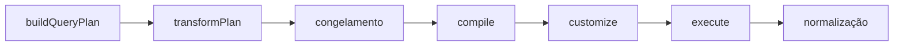

O `execute()` recebe um quarto argumento opcional: um objeto de opções com dois
hooks.

```typescript
execute(source, query, rules, {
  transformPlan?: (plan: TypedQueryPlan) => TypedQueryPlan,
  customize?: (native: TNative) => void,
  customizeScope?: 'data' | 'count' | 'both',   // default 'both'
})
```

Na `2.x` o quarto argumento era o próprio callback. Agora é um objeto, porque
são dois hooks diferentes em duas altitudes diferentes.

## O pipeline, e onde cada hook fica



A ordem é fixa. O `transformPlan` é o último ponto em que o plano pode mudar; o
`customize` roda depois da compilação, sobre o contexto nativo do adapter. Dados
e contagem derivam do mesmo plano congelado, e é por isso que as duas queries
sempre descrevem a mesma pergunta.

## `transformPlan` — agnóstico de adapter

Use para política que pertence à sua aplicação e tem de valer qualquer que seja
o ORM atrás da source: escopo de tenant expresso em termos de plano, um default
interno, uma projeção forçada. Ele recebe e devolve um `TypedQueryPlan`.

```typescript
await this.queryBuilderService.execute(source, query, rules, {
  // Hook comum a todos os adapters: tenant, soft delete, política interna.
  // Devolva o plano, ou uma cópia modificada dele.
  transformPlan: (plan) => plan,
});
```

<Callout type="warn" title="Devolva um plano novo; não mute o que você recebe">
  O plano entregue ao `transformPlan` já está **congelado em profundidade** —
  todo objeto, array e `Map` aninhado incluídos. Atribuir a uma propriedade dele
  estoura `TypeError` sob o modo estrito do sistema de módulos, então monte um
  objeto novo e devolva-o. O resultado é congelado outra vez antes da
  compilação, e é isso que impede um hook de mutar o plano entre a query de
  dados e a de contagem.
</Callout>

Note onde ele fica: parse, autorização e coerção já aconteceram, então o plano
que você recebe é válido — e os termos que você acrescenta a ele **não** são
revalidados antes da compilação. Um hook que introduz um termo que o schema não
atende é bug seu, não requisição recusada. Prefira remodelar o que o plano já
contém a inventar termos novos.

## `customize` — específico do adapter

Use para capacidades fora do contrato REST. Ele recebe o **contexto nativo**,
uma vez por query do escopo, e o que "nativo" significa depende do adapter:

| Adapter     | `TNative`                                |
| ----------- | ---------------------------------------- |
| **TypeORM** | o `SelectQueryBuilder<T>` tipado         |
| **Prisma**  | `{ kind: 'data' \| 'count', args }`      |
| **Drizzle** | `{ kind: 'data' \| 'count', statement }` |

```typescript title="TypeORM"
await this.queryBuilderService.execute(
  typeormSource(this.userRepository),
  query,
  rules,
  {
    customize: (qb) => {
      qb.andWhere('root.tenant_id = :tenant', { tenant });
    },
  }
);
```

```typescript title="Prisma"
await this.queryBuilderService.execute(
  prismaSource({ client: this.prisma, model: 'user', manifest }),
  query,
  rules,
  {
    customize: (native) => {
      native.args.where = { AND: [native.args.where ?? {}, { tenantId }] };
    },
  }
);
```

```typescript title="Drizzle"
await this.queryBuilderService.execute(
  drizzleSource({ db, dialect: 'postgres', table, relations }),
  query,
  rules,
  {
    customize: (native) => {
      native.statement.where = {
        op: 'and',
        terms: [
          ...(native.statement.where ? [native.statement.where] : []),
          {
            op: 'compare',
            ref: { alias: native.statement.alias, column: 'tenantId' },
            comparator: '=',
            value: tenant,
          },
        ],
      };
    },
  }
);
```

O alias do root no TypeORM é `root`.

<Callout type="info">
  Os parâmetros públicos da biblioteca (`filters`, `sorts`, `fields`,
  `includes`, `search`) falam sempre em **paths de campo declarados**. Dentro do
  `customize`, quando você escreve SQL como string, você passou dessa fronteira
  e usa os identificadores do próprio banco.
</Callout>

## `customizeScope`

O hook é invocado uma vez por query, não uma vez com as duas — e é isso que faz o
default funcionar de verdade.

| Escopo    | Atinge               | Use quando                                                              |
| --------- | -------------------- | ----------------------------------------------------------------------- |
| `'both'`  | dados **e** contagem | Default. Qualquer coisa que mude quais linhas qualificam.               |
| `'data'`  | a query de dados     | Algo que não pode aparecer numa contagem — e você aceita a divergência. |
| `'count'` | a query de contagem  | Raro; quase sempre um erro.                                             |

Um único `qb.andWhere(...)` sob `'both'`, portanto, cai nas duas queries. Um
escopo parcial deixa a contagem responder a uma pergunta diferente da dos dados —
então a biblioteca registra um aviso estruturado quando você escolhe um:

```
customize is scoped to a single query; data and count may diverge
```

## Quando usar o quê

| Necessidade                                               | Use                                           |
| --------------------------------------------------------- | --------------------------------------------- |
| Condições nunca expostas ao cliente (soft delete, tenant) | `customize`, ou `transformPlan`               |
| Filtrar pelo usuário autenticado                          | `customize`, ou `transformPlan`               |
| Busca full-text específica do banco                       | `customize`                                   |
| Um filtro que o cliente deve controlar                    | uma regra em `filters`, no `defineQueryRules` |
| Uma caixa de busca rápida sobre vários campos             | `search`, no `defineQueryRules`               |
| Carregamento de relação                                   | `includes`, no `defineQueryRules`             |

## Busca textual nativa

O `search` é parâmetro de primeira classe, não algo a construir no `customize`.
Declare os paths pesquisáveis nas regras e envie `?search=termo`:

```typescript
export const userRules = defineQueryRules(USER_SCHEMAS, 'user', {
  // ...
  search: ['name', 'email', 'company.name'],
});
```

Os alvos são combinados com `OR`, cada um comparado pela **coluna dobrada**
dele, contra o termo normalizado pelo mesmo `foldText`. Então nenhum `ILIKE` é
emitido, e o resultado não depende da collation do servidor. Um alvo que
atravessa uma relação `many` compila como `EXISTS` correlacionado, então a página
mantém o tamanho e o `total` continua contando roots.

Duas restrições vale repetir aqui: um path de `search` precisa de `foldedField`
ou a aplicação não sobe, e a dobra **não** remove diacrítico. Veja
[Regras de whitelist do endpoint](/pt-BR/docs/usage/endpoint-whitelist-rules).

### `search` versus `filter`

|                              | `filter[name][like]=john`           | `search=john`            |
| ---------------------------- | ----------------------------------- | ------------------------ |
| Quem escolhe o campo         | o cliente                           | o backend                |
| Passa por whitelist          | sim, por campo + operador           | sim, via `search`        |
| Vários campos ao mesmo tempo | não diretamente                     | sim, combinados com `OR` |
| Sensibilidade a caixa        | `like` é literal; `ilike` é dobrado | sempre dobrado           |

Ainda use `customize` quando a busca tiver de desviar disso: pesos por campo,
`AND` entre grupos de termos, um índice full-text específico do banco, ou regras
que dependam de tenant, papel ou contexto de autenticação.

## Inspecionando o plano

Não existe `buildQuery()` na v3 — nada te entrega um `SelectQueryBuilder`
meio-montado, porque o plano é o artefato sem ORM e cada adapter o compila. O
que existe é o `buildPlan`, que para logo depois do `transformPlan` e do
congelamento:

```typescript
const plan = this.queryBuilderService.buildPlan(query, rules, {
  transformPlan: (p) => p,
});
```

É a costura sobre a qual asseverar em testes, ou a que inspecionar quando uma
requisição não produz o SQL que você esperava. Para alcançar o builder do próprio
ORM, use o `customize`.
