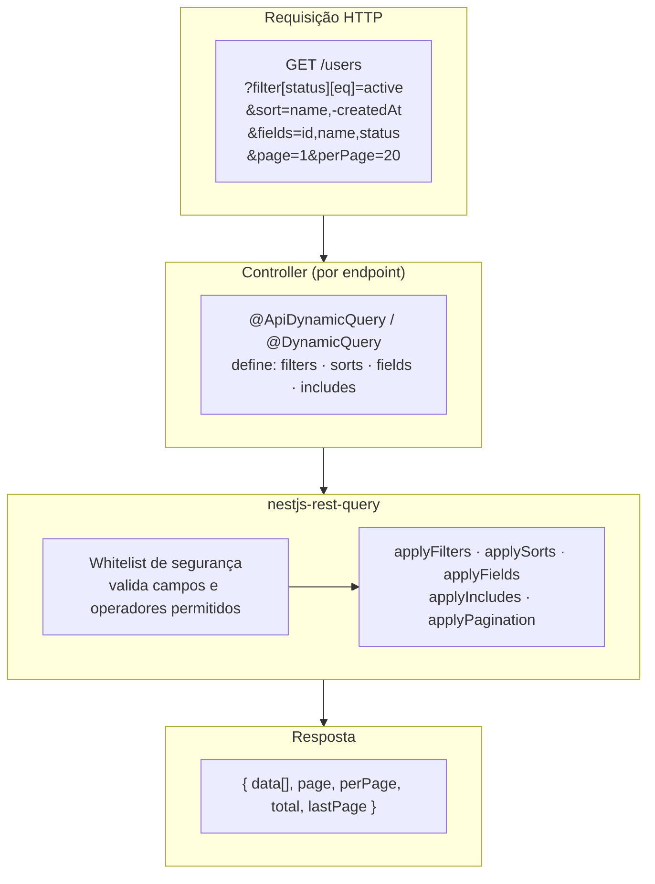

<Callout type="warn" title="Esta documentação descreve a v2">

Os exemplos abaixo ainda usam a API v2 — `RulesConfig`, classes de adapter no
entrypoint raiz e coerção pelo formato do valor. **A v3 substitui as três.**
Reescrever este site é a fase 7 do plano da v3; até lá, a descrição
autoritativa da API atual é
[o guia de migração v2 → v3](https://github.com/naldomadeira/nestjs-rest-query/blob/main/docs/migration/v2-to-v3.md).

</Callout>

**`nestjs-rest-query`** é uma biblioteca para NestJS que constrói instâncias de `SelectQueryBuilder` do TypeORM de forma dinâmica a partir de parâmetros de query HTTP — filtros, ordenações, paginação, seleção de campos e carregamento de relações — tudo controlado por uma whitelist de segurança por endpoint.

## Fluxo principal



Cada endpoint declara sua própria whitelist via `@ApiDynamicQuery` (com OpenAPI) ou `@DynamicQuery` (sem). Em runtime, `QueryBuilderService` valida os parâmetros recebidos contra essa whitelist, aplica cada handler e devolve o resultado já paginado.

## Funcionalidades

- **Filtros dinâmicos** — filtre por qualquer campo permitido usando operadores como `eq`, `like`, `in`, `between`, `isNull` e mais
- **Ordenação** — ordenação multi-coluna com `ASC` / `DESC`, controlada por endpoint
- **Paginação** — baseada em página ou limit/offset, com `page`, `perPage`, `total` e `lastPage` no topo da resposta
- **Seleção de campos** — retorne apenas as colunas que o cliente precisa
- **Carregamento de relações** — carregue relações TypeORM declaradas na sua whitelist
- **Whitelist de segurança** — os decorators `@ApiDynamicQuery` / `@DynamicQuery` definem exatamente quais campos e operadores cada endpoint permite
- **Integração com Swagger** — `@ApiDynamicQuery` gera automaticamente decorators `@ApiQuery` para todos os parâmetros de query suportados
- **Totalmente tipado** — escrito em TypeScript, com definições de tipos completas

## Como funciona

1. Decore o método do seu controller com `@ApiDynamicQuery(rules)` (ou `@DynamicQuery(rules)`)
2. Adicione `@QueryRules()` como decorator de parâmetro para receber as regras em tempo de execução
3. Chame `queryBuilderService.execute(repo, query, rules)` — a biblioteca aplica filtros, ordenações, paginação e relações, retornando os resultados com os dados de paginação no topo da resposta

```typescript
@Get()
@ApiDynamicQuery({
  filters: ['name', 'status', 'createdAt'],
  sorts: ['name', 'createdAt'],
  includes: ['company'],
})
findAll(
  @Query() query: DynamicQueryDto,
  @QueryRules() rules: RulesConfig,
) {
  return this.queryBuilderService.execute(this.repo, query, rules);
}
```

## Começar

<Cards>
  <Card
    title="Pré-requisito NestJS"
    href="/docs/getting-started/prerequisites"
  />
  <Card title="Instalação" href="/docs/getting-started/installation" />
  <Card title="Primeiro endpoint" href="/docs/getting-started/first-endpoint" />
  <Card title="Swagger" href="/docs/swagger" />
  <Card title="Customizando a Query" href="/docs/advanced/customizing" />
</Cards>
