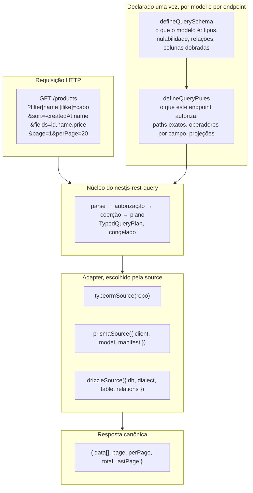

<Callout type="warn" title="Estas páginas descrevem a v3, que ainda não foi publicada">

A API `3.x` descrita neste site está implementada no repositório, exercitada por
quatro aplicações de exemplo e por uma matriz de paridade de nove células, mas a
última versão no npm continua sendo a `2.1.0`. Os gates que faltam para a
release estão em
[`docs/v3/status.md`](https://github.com/naldomadeira/nestjs-rest-query/blob/main/docs/v3/status.md).
Se você está na `2.x` hoje, leia
[o guia de migração](https://github.com/naldomadeira/nestjs-rest-query/blob/main/MIGRATION.md#2x--3x)
antes de subir de versão — a v3 não tem modo de compatibilidade.

</Callout>

O **`nestjs-rest-query`** transforma parâmetros de query HTTP — filtros,
ordenações, paginação, seleção de campos, carregamento de relações e busca
textual — num plano de query tipado, autoriza esse plano contra uma whitelist
por endpoint e deixa um adapter de ORM compilá-lo. TypeORM, Prisma e Drizzle são
atendidos pelo mesmo núcleo, e devem responder à mesma requisição da mesma
forma.

## Fluxo principal



As regras compiladas do endpoint são a fonte única de duas coisas ao mesmo
tempo: a autorização em runtime e os parâmetros OpenAPI que
`@ApiDynamicQuery(rules)` gera. Elas não podem divergir, porque não são duas
declarações.

## O que a v3 mudou

Se você conhece a API `2.x`, quatro coisas são diferentes em natureza, não em
grau:

- **O schema é declarado, não adivinhado.** O `kind` declarado do campo decide
  como o texto recebido é coagido, então `"00430123"` continua a string
  `"00430123"` em vez de virar o número `430123`.
- **O adapter vem da source, não do `forRoot`.** O pacote raiz não carrega ORM
  nenhum; `forRoot({ adapter })` é recusado na inicialização.
- **A whitelist casa paths exatos.** Autorizar a relação `company` não autoriza
  mais `company.name`.
- **Configuração impossível falha quando a aplicação sobe**, não na primeira
  requisição que por acaso passe por ela.

## Recursos

- **Filtros dinâmicos** — 14 operadores (`eq`, `ne`, `like`, `ilike`,
  `notLike`, `notIlike`, `gt`, `gte`, `lt`, `lte`, `in`, `notIn`, `between`,
  `isNull`), autorizados por campo
- **Ordenação** — múltiplas colunas, `-` para descendente, recusada onde a
  ordem não seria portável entre bancos
- **Paginação** — `page`/`perPage` com `total` e `lastPage`, ou
  `paginate=false`
- **Seleção de campos** — `fields=`, limitado por uma projeção declarada por
  nível
- **Carregamento de relações** — `includes=`, cada relação com a projeção de
  campos dela
- **Busca textual portável** — `search=` sobre colunas pré-normalizadas
  (dobradas), então a mesma requisição devolve as mesmas linhas
  independentemente da collation do servidor
- **Envelope de erro estável** — toda recusa carrega um `code` legível por
  máquina
- **Três adapters de ORM** atrás de um núcleo só, mais um corpus de paridade que
  compara os três

## Endpoint mínimo

Duas declarações e uma chamada. Este é o
[`apps/examples/01-starter-app`](https://github.com/naldomadeira/nestjs-rest-query/tree/main/apps/examples/01-starter-app),
aparado:

```typescript title="product.query.ts"
import { defineQueryRules, defineQuerySchema } from 'nestjs-rest-query';
import type { QuerySchema, SchemaRegistry } from 'nestjs-rest-query';

const productSchema: QuerySchema = defineQuerySchema({
  model: 'product',
  primaryKey: ['id'],
  fields: [
    { path: 'id', kind: 'integer', nullable: false, primaryKey: true },
    {
      path: 'name',
      kind: 'string',
      nullable: false,
      primaryKey: false,
      foldedField: 'name_folded',
    },
    {
      path: 'name_folded',
      kind: 'string',
      nullable: false,
      primaryKey: false,
      internal: true,
    },
    { path: 'price', kind: 'decimal', nullable: false, primaryKey: false },
    { path: 'createdAt', kind: 'datetime', nullable: false, primaryKey: false },
  ],
  relations: [],
});

export const PRODUCT_SCHEMAS: SchemaRegistry = new Map([
  ['product', productSchema],
]);

export const productRules = defineQueryRules(PRODUCT_SCHEMAS, 'product', {
  filters: [
    { path: 'id', operators: ['eq', 'in'] },
    { path: 'name', operators: ['eq', 'like', 'ilike'] },
    { path: 'price', operators: ['eq', 'gt', 'gte', 'lt', 'lte', 'between'] },
  ],
  sorts: ['id', 'name', 'price', 'createdAt'],
  fields: {
    root: {
      allowed: ['id', 'name', 'price', 'createdAt'],
      default: ['id', 'name', 'price', 'createdAt'],
    },
  },
  search: ['name'],
});
```

```typescript title="product.controller.ts"
@Get()
@ApiDynamicQuery(productRules)
async findAll(
  @Query() query: DynamicQueryDto,
  @QueryRules() rules: CompiledQueryRules,
) {
  return this.productService.findAll(query, rules);
}
```

```typescript title="product.service.ts"
import { typeormSource } from 'nestjs-rest-query/typeorm';

async findAll(
  query: DynamicQueryDto,
  rules: CompiledQueryRules,
): Promise<NormalizedQueryResult<Product>> {
  return this.queryBuilderService.execute(
    typeormSource(this.productRepository),
    query,
    rules,
  );
}
```

`productRules` é construído no carregamento do módulo, fora da classe, porque
`@ApiDynamicQuery` é um decorator de método e roda antes de o Nest ter container
ou repositório.

## Comece por aqui

<Cards>
  <Card
    title="Pré-requisito NestJS"
    href="/pt-BR/docs/getting-started/prerequisites"
  />
  <Card title="Instalação" href="/pt-BR/docs/getting-started/installation" />
  <Card
    title="Primeiro endpoint"
    href="/pt-BR/docs/getting-started/first-endpoint"
  />
  <Card title="Adapters" href="/pt-BR/docs/adapters" />
  <Card title="Swagger" href="/pt-BR/docs/swagger" />
  <Card title="Customizando a Query" href="/pt-BR/docs/advanced/customizing" />
</Cards>
