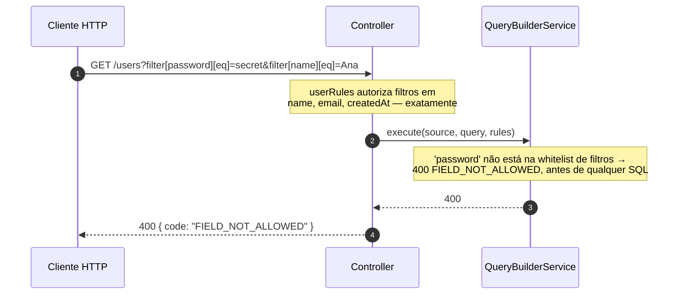

Se você ainda não tem um endpoint funcionando, comece por
[Primeiro endpoint](/pt-BR/docs/getting-started/first-endpoint). Esta página é a
referência dos decorators, do formato do fio e dos dois envelopes. As regras têm
página própria:
[Regras de whitelist do endpoint](/pt-BR/docs/usage/endpoint-whitelist-rules).

## Decorators

### `@ApiDynamicQuery(rules)`

Decorator de método para endpoints que precisam de documentação OpenAPI. Ele faz
duas coisas ao mesmo tempo:

- guarda as **regras compiladas** no método, onde `@QueryRules()` as lê em
  runtime;
- gera `@ApiQuery` para os parâmetros que este endpoint realmente suporta —
  `page`, `perPage`, `paginate` sempre, e `sort`, `fields`, `includes`, `search`
  e `filter` só quando as regras declaram algo para eles.

```typescript
@Get()
@ApiDynamicQuery(userRules)
async findAll(/* ... */) {}
```

Ele recebe o objeto que `defineQueryRules(...)` devolveu. **Não é genérico** — um
`@ApiDynamicQuery<User>(...)` que sobrou dá
`TS2558: Expected 0 type arguments, but got 1`.

<Callout type="warn">
  O decorator é avaliado quando a classe do controller carrega, antes de o Nest
  ter container ou repositório. Compile as regras no escopo do módulo, em
  arquivo próprio, não dentro da classe.
</Callout>

### `@DynamicQuery(rules)`

Mesmo registro, **sem geração OpenAPI**. Use em endpoints internos ou quando o
`@nestjs/swagger` não está instalado.

### `@QueryRules()`

Decorator de **parâmetro** que lê as regras registradas por `@ApiDynamicQuery`
ou `@DynamicQuery` no mesmo método e as injeta como argumento.

```typescript
async findAll(
  @Query() query: DynamicQueryDto,
  @QueryRules() rules: CompiledQueryRules,
) {}
```

O `@QueryRules()` depende de um dos decorators de método estar presente. Sem ele
não há regras a entregar.

## Controller completo

```typescript title="users.controller.ts"
import { Controller, Get, Query } from '@nestjs/common';
import { ApiOperation, ApiTags } from '@nestjs/swagger';
import {
  ApiDynamicQuery,
  ApiPaginatedResponse,
  DynamicQueryDto,
  QueryRules,
  type CompiledQueryRules,
  type NormalizedQueryResult,
} from 'nestjs-rest-query';
import { User } from './entities/user.entity';
import { UsersBusiness } from './users.business';
import { userRules } from './users.query';

@ApiTags('users')
@Controller('users')
export class UsersController {
  constructor(private readonly usersBusiness: UsersBusiness) {}

  @Get()
  @ApiOperation({ summary: 'Lista usuários com filtros dinâmicos' })
  @ApiDynamicQuery(userRules)
  @ApiPaginatedResponse(User, { description: 'Lista de usuários' })
  async findAll(
    @Query() query: DynamicQueryDto,
    @QueryRules() rules: CompiledQueryRules
  ): Promise<NormalizedQueryResult<User>> {
    return this.usersBusiness.findAll(query, rules);
  }
}
```

## Serviço

Injete o `QueryBuilderService` e o seu repositório/client normalmente. O módulo
é `@Global`, então o serviço fica disponível em qualquer provider sem importar o
`DynamicQueryBuilderModule` de novo.

```typescript title="users.business.ts"
import { typeormSource } from 'nestjs-rest-query/typeorm';

@Injectable()
export class UsersBusiness {
  constructor(
    @InjectRepository(User)
    private readonly userRepository: Repository<User>,
    private readonly queryBuilderService: QueryBuilderService
  ) {}

  async findAll(
    query: DynamicQueryDto,
    rules: CompiledQueryRules
  ): Promise<NormalizedQueryResult<User>> {
    return this.queryBuilderService.execute(
      typeormSource(this.userRepository),
      query,
      rules
    );
  }
}
```

O `execute(source, query, rules, options?)` recebe uma **source**, não um
repositório. Veja [Adapters](/pt-BR/docs/adapters) para as três fábricas de
source e [Customizando a Query](/pt-BR/docs/advanced/customizing) para as
`options`.

## Parâmetros de query suportados

| Parâmetro  | Formato                        | Exemplo                              |
| ---------- | ------------------------------ | ------------------------------------ |
| `filter`   | `filter[path][operador]=valor` | `filter[email][eq]=ana@example.com`  |
| `sort`     | lista de paths, `-` para desc  | `sort=-createdAt,name`               |
| `fields`   | lista de paths                 | `fields=id,name,company.name`        |
| `includes` | lista de paths de relação      | `includes=company,posts`             |
| `search`   | texto livre                    | `search=ana`                         |
| `page`     | inteiro positivo               | `page=2`                             |
| `perPage`  | inteiro positivo               | `perPage=25`                         |
| `paginate` | `true` / `false` / `1` / `0`   | `paginate=false` (devolve só `data`) |

Detalhes fáceis de errar:

- O parâmetro é `sort`, singular. A propriedade das **regras** é `sorts`.
- `filter[name]=Ada` é a forma curta de `filter[name][eq]=Ada`.
- Listas aceitam parâmetro repetido/array (preferível, o `qs` expande) ou CSV. O
  CSV suporta aspas e escape por barra invertida, então
  `filter[name][in]="A, B"` é um item e não dois.
- `page`/`perPage` querem inteiro decimal positivo simples. `?page=` (presente e
  vazio) é `400`, não uma queda para a página 1.
- Um `perPage` acima do `maxPerPage` é `400`, não um corte silencioso.
- Um path precisa estar autorizado **exatamente**. `fields=company.name` também
  exige `company` em `includes`, tanto na requisição quanto nas regras — a
  seleção nunca traz uma relação implicitamente.

### Operadores de filtro

Todos os 14, na ordem em que a biblioteca os lista:

| Operador   | Significado                                  | Aplica-se a                                           |
| ---------- | -------------------------------------------- | ----------------------------------------------------- |
| `eq`       | igual                                        | qualquer kind não opaco                               |
| `ne`       | diferente                                    | qualquer kind não opaco                               |
| `like`     | contém, padrão literal                       | `string`, `uuid`, `enum`                              |
| `ilike`    | contém, com dobra de caixa                   | `string`, `uuid`, `enum` **com `foldedField`**        |
| `notLike`  | não contém, padrão literal                   | `string`, `uuid`, `enum`                              |
| `notIlike` | não contém, com dobra de caixa               | `string`, `uuid`, `enum` **com `foldedField`**        |
| `gt`       | maior que                                    | kinds com ordem portável, ou com `portableOrderField` |
| `gte`      | maior ou igual                               | idem                                                  |
| `lt`       | menor que                                    | idem                                                  |
| `lte`      | menor ou igual                               | idem                                                  |
| `in`       | está na lista                                | qualquer kind não opaco                               |
| `notIn`    | não está na lista                            | qualquer kind não opaco                               |
| `between`  | entre dois valores, inclusive                | kinds com ordem portável, ou com `portableOrderField` |
| `isNull`   | `IS NULL` (`true`) / `IS NOT NULL` (`false`) | campos **nuláveis**, e relações                       |

`json` e `binary` são opacos: nenhum operador é inferido para eles.

Quatro comportamentos que vale saber:

- **`%`, `_` e `\` são literais.** `filter[name][like]=100%` procura o texto
  "100%". Sob Prisma em `sqlite`/`sqlserver` essa promessa não pode ser
  cumprida, então esses cinco operadores de padrão são recusados lá — veja
  [adapter Prisma](/pt-BR/docs/adapters/prisma).
- **`in=[]` devolve zero linhas** (condição sempre falsa) e **`notIn=[]` devolve
  tudo**. Na `2.x` um `in` vazio era ignorado.
- **`between` precisa de exatamente dois valores**, senão
  `400 FILTER_VALUE_INVALID`.
- **`isNull` sobre relação** pergunta sobre a própria relação:
  `filter[company][isNull]=true` acha as linhas sem empresa, e numa relação
  `many` significa "coleção vazia" — compilado como `NOT EXISTS`, nunca como
  join.

### Coerção de valor, pelo kind declarado

A coerção segue o `kind` do campo, nunca a aparência do texto. Esta é a maior
mudança observável em relação à `2.x`, onde `"00430123"` virava `430123`.

| Kind       | Entrada aceita                                                 |
| ---------- | -------------------------------------------------------------- |
| `string`   | qualquer string, **sem trim** — espaço faz parte do valor      |
| `uuid`     | um UUID canônico                                               |
| `enum`     | um membro declarado                                            |
| `integer`  | inteiro decimal, sem zero à esquerda, dentro da faixa segura   |
| `bigint`   | inteiro decimal, carregado como `bigint`                       |
| `decimal`  | decimal finito canônico, mantido exato — nunca float           |
| `boolean`  | `true`, `false`, `1`, `0`                                      |
| `date`     | `YYYY-MM-DD`, e tem de ser data de calendário real             |
| `datetime` | ISO 8601 **com offset ou `Z`** — timestamp sem fuso é recusado |

Qualquer outra coisa é `400 FILTER_VALUE_INVALID`, e `details` nunca ecoa o
valor que o cliente enviou.

## O envelope de resposta

```json
{
  "data": [
    { "id": 1, "name": "Ana Lima", "email": "ana@example.com" },
    { "id": 2, "name": "Bruno Costa", "email": "bruno@example.com" }
  ],
  "page": 1,
  "perPage": 20,
  "total": 42,
  "lastPage": 3
}
```

Com `paginate=false` a resposta é `{ "data": [...] }` e nada mais. O `lastPage`
nunca é `0` — o contrato promete no mínimo `1`.

Quem produz esse JSON é o núcleo, não o adapter. Duas consequências:

- **A codificação de saída é uniforme.** `bigint` e `decimal` são serializados
  como string, `datetime` como instante ISO, `date` como `YYYY-MM-DD`, `binary`
  como base64 — independentemente de o driver ter devolvido string, number ou
  `Date`.
- **Colunas internas nunca aparecem**, e uma chave primária que não faz parte da
  projeção visível é removida mesmo que o adapter tenha precisado selecioná-la
  para hidratação, deduplicação e paginação.

## O envelope de erro

```json
{
  "statusCode": 400,
  "code": "FIELD_NOT_ALLOWED",
  "message": "filter path is not allowed: secret",
  "details": { "path": "secret", "scope": "filter", "allowed": ["id", "name"] }
}
```

Ramifique no `code`, nunca na `message`.

| Código                         | Status     | Quando                                                                                                                                                                                                         |
| ------------------------------ | ---------- | -------------------------------------------------------------------------------------------------------------------------------------------------------------------------------------------------------------- |
| `QUERY_SYNTAX_INVALID`         | 400        | path ou operador fora do alfabeto seguro, lista malformada                                                                                                                                                     |
| `QUERY_SYNTAX_UNKNOWN_PARAM`   | 400        | declarado no contrato, **não emitido hoje**                                                                                                                                                                    |
| `FIELD_NOT_ALLOWED`            | 400        | o path não está na whitelist daquele escopo                                                                                                                                                                    |
| `FIELD_NOT_FOUND`              | 400        | o path está na whitelist mas não existe no schema                                                                                                                                                              |
| `RELATION_NOT_FOUND`           | 400        | um salto de relação do path não existe                                                                                                                                                                         |
| `OPERATOR_NOT_ALLOWED`         | 400        | o campo não autoriza aquele operador                                                                                                                                                                           |
| `OPERATOR_TYPE_MISMATCH`       | 400        | o operador não faz sentido para aquele kind — `like` num integer, `sort` através de relação `many`                                                                                                             |
| `FILTER_VALUE_INVALID`         | 400        | o valor não decodifica para o kind declarado                                                                                                                                                                   |
| `PAGINATION_INVALID`           | 400        | `page`, `perPage` ou `paginate` não é literal válido, ou excede o `maxPerPage`                                                                                                                                 |
| `SORT_CONFLICT`                | 400        | o mesmo path foi pedido ascendente e descendente                                                                                                                                                               |
| `CAPABILITY_UNAVAILABLE`       | 400 ou 500 | o operador ou a forma não pode ser atendida: sem coluna dobrada, sem ordem portável, padrões do Prisma em `sqlite`/`sqlserver` (400); chave primária sem ordem portável ou cadeia existencial no TypeORM (500) |
| `PORTABILITY_PROFILE_MISMATCH` | 500        | `portability.enforce` ligado e os fatos do perfil da source não batem                                                                                                                                          |
| `SOURCE_CONFIGURATION_INVALID` | 500        | o schema declarado não bate com a source, ou o `forRoot` recebeu chave removida                                                                                                                                |
| `ADAPTER_CONTRACT_VIOLATION`   | 500        | o adapter não consegue compilar uma forma que o plano pediu                                                                                                                                                    |

A divisão é deliberada: entrada do cliente é `400`, e erro na sua declaração é
`500`, porque é bug da aplicação e não da requisição. A maior parte dos erros de
configuração aparece enquanto a aplicação sobe, não numa requisição.

## Como a whitelist protege o endpoint



Nada chega ao banco antes de todo path e todo operador terem sido autorizados.

## Próximos passos

<Cards>
  <Card
    title="Regras de whitelist do endpoint"
    href="/pt-BR/docs/usage/endpoint-whitelist-rules"
  />
  <Card title="Adapters" href="/pt-BR/docs/adapters" />
  <Card title="Swagger" href="/pt-BR/docs/swagger" />
  <Card title="Customizando a Query" href="/pt-BR/docs/advanced/customizing" />
</Cards>
